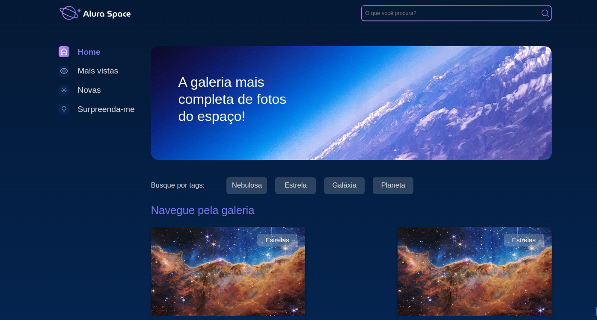

<hr>

# ALR Space

Bem-vindo ao ALR Space! 🚀 Este é um repositório dedicado ao projeto ALR Space, uma plataforma incrível para explorar o universo.

## Descrição

ALR Space é uma aplicação web que oferece uma variedade de recursos e conteúdos relacionados à imagens do universo. Este repositório contém o código-fonte e os arquivos essenciais para executar a aplicação em sua máquina local.

## Funcionalidades Principais

- 🌐 Exploração do Universo
- 📚 Recursos Educativos
- 💻 Ambiente de Desenvolvimento Integrado (IDE)
- 🚀 Projetos e Exemplos Práticos

## Instruções de Instalação

Siga estas etapas para configurar o ALR Space em sua máquina:

1. **Clone o Repositório:**

   ```bash
   git clone https://github.com/devbdallagnol/alr_space.git
   ```

2. **Crie o ambiente virtual:**

   ```bash
   python -m venv venv
   ```

3. **Acesse o ambiente virtual:**

   ```bash
   source venv/bin/activate
   ```

4. **Instale os pacotes:**

   ```bash
   pip install -r requirements.txt
   ```

5. **Aplique as migrações:**

   ```bash
   python manage.py migrate
   ```

6. **Rode a aplicação:**

   ```bash
   python manage.py runserver
   ```

### Contribuição

Contribuições são bem-vindas! Se você deseja melhorar o ALR Space, siga estas diretrizes:

Faça um Fork do projeto
Crie uma nova branch (git checkout -b feature/nova-feature)
Faça commit das suas alterações (git commit -am 'Adiciona nova feature')
Faça push para a branch (git push origin feature/nova-feature)
Abra um Pull Request
Contato
Se precisar de ajuda ou tiver alguma dúvida, sinta-se à vontade para entrar em contato:

Desenvolvedor: Nome do Desenvolvedor
Email: desenvolvedor@email.com
